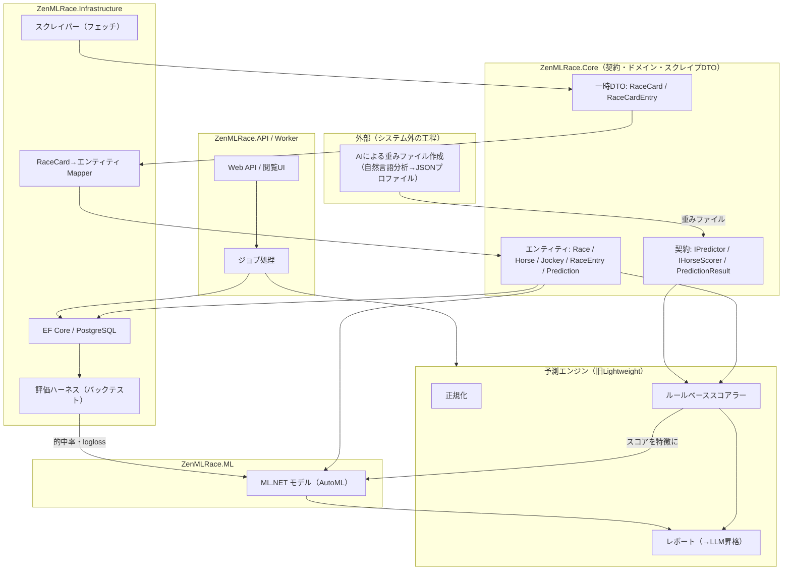

# Zen ML Race アーキテクチャ設計・移行計画

本書は、現状の実装と最終目標のギャップを整理し、実用ラインを止めずに段階移行するための設計指針をまとめる。
着手前の合意ポイントとして扱い、変更があれば本書を更新する。

## 1. 最終目標

以下の4本柱を揃えることを最終目標とする。

1. データスクレイピング
2. ML（ML.NET による機械学習。これ自体がプロジェクトのテーマ）
3. サーバーマシンでスタンドアロン稼働し、Web経由でデータ閲覧・予測支援
4. LLM・AIを活用した自然言語ベースの予測支援

補足として、最終形では「AIの自然言語ベースの分析・重み」が「ML.NETのパラメータ調整・レポート」へ接合されることを目指す。
ただし後述の設計原則に従い、健全な形に限定する。

## 2. 現状の課題

### 2.1 2つの半完成アーキテクチャの並走

リポジトリには実質2系統が並走しており、これが最大の負債である。

- **Lightweight系**（`ZenMLRace.Lightweight` ほか）: 実際に動作し、春競馬で数戦の予測実績を持つ「本当の心臓」。
- **本体系**（`Core` / `Infrastructure` / `ML` / `Worker` / `API`）: 設計は立派だがほぼスケルトン。`Class1.cs`や`TODO`が残る。

両者でスクレイピングが2系統、型定義も2系統に分かれている。
`ZenMLRace.Lightweight/Contracts/PredictionContracts.cs`には`// TODO: Coreのものと統合`が明記されており、DRY観点の不整合が自認されている。

### 2.2 目標に対する現状マッピング

| 目標 | 現状の実装 | 実態 |
|------|-----------|------|
| ①スクレイピング | `JraHtmlFetcher`（Lightweight） / `PlaywrightRaceCollector`（Infra） | 前者は動作するがJRA公式G1・開催週限定。後者は空モック。履歴の蓄積機構が無い |
| ②ML | `ZenMLRace.ML` | 空箱。ML.NET参照すら無い。予測は全てLightweightのルールベース |
| ③スタンドアロン + Web閲覧 | `API` / `Worker` / PostgreSQL | 全てスケルトン。閲覧UIは無く、予測ジョブは投げても実処理が無い |
| ④LLM自然言語支援 | `DeterministicInsightNarrator` | テンプレート文章。LLM連携は未着手 |

### 2.3 Lightweightに欠けている統合点

Lightweightは正規化した後にDBへ一切書き込まず、`PredictionResult`も永続化しない。
API→ジョブ→Workerの導線からLightweightエンジンが呼ばれてもいない。
「AIによる重みファイル作成」以外を本システムへ統合するにあたり、以下のインターフェースが不足している。

1. `RaceCard`（スクレイプ結果）→ `Race` / `Horse` / `RaceEntry`（エンティティ）へのマッパー。
2. `PredictionResult`を保存する`Prediction`エンティティ。
3. Workerのジョブ処理が実際にLightweightエンジンを呼ぶ配線（`IPredictor`のDI登録）。

## 3. 基本方針

### 3.1 Lightweightを本体へ昇格・吸収する

動作している資産を捨てて空箱を育てるのは筋が悪い。
Lightweightのルールベースエンジンを本体の正式メンバーとし、本体は「その周りにデータ基盤・Web・LLMを足す器」と再定義する。
2つの半完成を抱え続けるより、1つの完成を目指す。

「AIによる重みファイル作成」（創造的・分析的パート）は、このシステムの外側の工程として残す。
それ以外のフェッチ・正規化・スコアリング・レポートは本システムへ統合する。

### 3.2 DTO統合は「1つの型に潰す」ではなく「3層分離」

`Contracts`と`Core.Entities`を単純マージすると、永続化エンティティに一時的なスクレイピング都合が混入する「神モデル」アンチパターンに陥る。
統合の正解は「1つの家（Core）に集める + 役割で3層に分離」する。

| 層 | 役割 | 該当型 | あるべき場所 |
|----|------|--------|------------|
| ドメインエンティティ | 永続化の真実（EF Core・DB） | `Race` `Horse` `Jockey` `RaceEntry` | Core（現状維持。ただし後述のバグ修正） |
| 契約（Contract） | 系全体が共有する共通語 | `IPredictor` `IHorseScorer` `PredictionRequest` `PredictionResult` `HorseScore` プロファイル系 | Coreへ移設（現状Lightweightに閉じているのが元凶） |
| 一時スクレイプDTO | パーサの出力 | `RaceCard` `RaceCardEntry` `RaceCardPastRun` `NormalizedRaceData` | Coreに置くがEFエンティティとは別物のまま + 橋渡しのMapper |

特に`HorseProfile`は3つの概念が混在している。

- 馬の同一性（→ `Horse`）
- そのレースでの枠番・馬番（→ `RaceEntry`）
- 前走の着順・人気の要約（→ 過去の`RaceEntry`）

統合後のスコアラーは、この寄せ集めではなく`RaceEntry`（`Horse`へのナビゲーション付き）+ 過去`RaceEntry`群を入力とするのが筋である。

### 3.3 既知の要修正点

- `Horse.Father` / `Horse.Mother`が`required`のため、血統不明馬を1件も保存できない。
  `Horse?`へ変更し、EF CoreのFKもNULL許容にする。
- `ZenMLRace.API/Program.cs`と`ZenMLRace.Worker`の二重構成が矛盾している。
  READMEは別プロセス設計だが、実際はAPIプロセス内で`AddHostedService<Worker>()`しChannelを共有している。
  Workerプロジェクトの位置づけを確定させる（別プロセス化するか、API内包に定めるか）。
- Workerが`AddHostedService`（Singleton）でありながら`AddScoped`の`IRaceCollector`を直接注入している。
  Scopedサービスは`IServiceScopeFactory`経由でジョブ単位に解決する。
- 依存パッケージの既知脆弱性。
  `Microsoft.OpenApi 2.0.0`（API）と`System.Security.Cryptography.Xml 9.0.0`（Infrastructure）に高重大度の警告がある。

## 4. AI・ML接合の設計原則

最終形では「AIの自然言語分析・重み」を「ML.NETのパラメータ調整・レポート」へ接合する。
接合は3点に分かれ、健全度が異なる。

| 接合 | 中身 | 健全度 |
|------|------|--------|
| ①AI重み → MLの特徴量・事前分布 | 重みファイルのスコアをMLモデルへの入力特徴やベースラインとして使う（アンサンブル・スタッキング） | 王道 |
| ②ML出力 + AI分析 → レポート | LLMがML予測・特徴量寄与を読んで自然言語レポート化（`DeterministicInsightNarrator`のLLM昇格） | 一方向・低リスク |
| ③AI → ML.NETのパラメータ調整 | LLMがハイパーパラメータや特徴を提案 | やり方次第で毒 |

### 4.1 原則: ループは「実測」で閉じる

**LLMは提案し、データが裁定する。**

LLMは勾配情報を持たないため、閉ループで直接モデルを調整させると「当てずっぽうの自信」を生む。
③の正しい形は次の通り。

1. LLMが重み・特徴の変更を提案する。
2. バックテストで実履歴に対して採点する。
3. 良かった版だけを採用する（人または閾値ゲート）。

自動ハイパーパラメータ探索はML.NETのAutoMLが正しい道具であり、LLMの仕事ではない。

### 4.2 重みファイルを接合の中心成果物にする

`RacePredictionProfile`（JSON重み）を次の性質を持つ成果物に育てる。

- 機械可読な設定（既にそうなっている）。
- 版管理・バックテスト可能。
- 人・LLM・MLの誰もが著者になれる。

これにより、同じ1つの成果物が接合点になる。
AIが書く→バックテストが採点→ML.NETはその版を特徴に使うか次の版を提案する→レポート層が全体を説明する。
著者が3種いても成果物は1つに集約される。

### 4.3 前提: バックテスト層が無ければ接合は成立しない

この接合は評価ハーネス無しには存在できない。
「AI分析をML調整へ反映する」の反映先（実レース結果に対する的中率・logloss）が無ければ、接合は絵に描いた餅になる。
現状リポジトリには的中率を測る仕組みが無く、既存の春競馬プロファイルは感覚でチューニングされている。
評価ハーネスは接合実現の土台であり、データ基盤の直後に置く。

## 5. 移行フェーズ

実用ライン（Lightweightの予測）を止めずに段階移行する。

| フェーズ | 内容 | 狙い |
|---------|------|------|
| Phase 0（急務） | 型の一本化。Contracts + インターフェースをCoreへ移設し、Lightweightは参照するだけにする | 動作を変えない純リファクタ。リスク最小。全ての解錠点 |
| Phase 1 | 永続化の橋渡し。`RaceCard`→エンティティのMapper、`Prediction`保存 | スクレイプ結果と予測をDBへ載せる |
| Phase 2 | 配線。Worker/APIがLightweightエンジンを呼ぶ | 実用ラインが「システム」になる |
| Phase 3 | データ基盤。結果ラベル付き履歴の定期収集 | MLとバックテスト共通の燃料タンク |
| Phase 3.5 | 評価ハーネス。重みファイル版 × 実履歴 → 的中率・logloss | 接合の「測る物差し」 |
| Phase 4 | ML.NET。①特徴化 + AutoMLで学習・評価。ルールベースと併走比較 | MLテーマの本丸 |
| Phase 5 | AI接合。②レポート昇格 + ③提案→バックテスト裁定ループ | 自然言語支援と接合の完成 |

### 5.1 今季（秋競馬）との二段構え

菊花賞から有馬記念は10〜12月であり、フル構想は今季には乗らない。
「今季はLightweight強化で実用を凌ぐ」「リビルドは並行で土台（Phase 0〜3）を作る」の二段構えとする。

## 6. 目標アーキテクチャ

## 7. 決定事項ログ

| 日付 | 決定 |
|------|------|
| 2026-09-16 | Lightweightを本体へ昇格・吸収する方針で合意 |
| 2026-09-16 | DTO統合は「3層分離」で進める方針で合意 |
| 2026-09-16 | AI・ML接合は「LLMは提案・データが裁定」「重みファイルを中心成果物」の原則で合意 |
| 2026-09-16 | ドキュメントはリポジトリ追跡可能なMarkdownとして`docs/architecture.md`に置く |
